# Gerrit Workflow Sequence Diagram

This diagram shows the complete Gerrit workflow from initial push to merge, including all key actors, systems, and decision points.

```mermaid
sequenceDiagram
    participant Dev as Developer
    participant Git as Git Client
    participant Hook as Commit-msg Hook
    participant Server as Gerrit Server
    participant PreHook as PreReceive Hook
    participant ChangeSvc as Change Service
    participant DB as Database
    participant PostHook as PostReceive Hook
    participant Reviewer as Reviewer
    participant CI as CI/CD System

    Note over Dev,CI: Phase 1: Initial Change Creation

    Dev->>Git: git commit -m "Add new feature"
    Git->>Hook: Execute commit-msg hook
    Hook->>Hook: Generate Change-Id
    Hook->>Git: Add Change-Id to commit message
    Git->>Git: Create commit with Change-Id
    
    Dev->>Git: git push origin HEAD:refs/for/trunk
    Git->>Server: HTTP POST /git-receive-pack
    
    Server->>PreHook: Process push to refs/for/trunk
    PreHook->>PreHook: Extract Change-Id from commit
    PreHook->>PreHook: Validate Change-Id format
    
    alt Valid Change-Id
        PreHook->>ChangeSvc: processChange(commit, targetBranch)
        ChangeSvc->>DB: Create new change record
        ChangeSvc->>DB: Create patch set record
        DB->>ChangeSvc: Return changeId and patchSetId
        ChangeSvc->>PreHook: Return ProcessResult
        
        PreHook->>PreHook: Create virtual branch refs/changes/XX/CHANGEID/1
        PreHook->>Server: Allow push, create virtual branch
        Server->>Git: Success response
        
        PostHook->>PostHook: Process post-receive actions
        PostHook->>CI: Trigger CI/CD pipeline
        PostHook->>Server: Send notifications
        
        Note over Dev,CI: Phase 2: Code Review Process
        
        Reviewer->>Server: Review change via web UI/API
        Reviewer->>Server: Add comments and feedback
        Server->>DB: Store review comments
        Server->>Dev: Send review notification
        
        alt Changes Requested
            Dev->>Git: git fetch origin refs/changes/12/CHANGEID/1
            Git->>Server: Fetch virtual branch
            Server->>Git: Return change content
            Git->>Git: Checkout FETCH_HEAD
            
            Dev->>Git: Make code changes
            Dev->>Git: git add .
            Dev->>Git: git commit --amend
            Git->>Hook: Execute commit-msg hook
            Hook->>Hook: Preserve existing Change-Id
            Hook->>Git: Update commit message
            
            Dev->>Git: git push origin HEAD:refs/for/trunk
            Git->>Server: HTTP POST /git-receive-pack
            
            Server->>PreHook: Process push to refs/for/trunk
            PreHook->>PreHook: Extract Change-Id from commit
            PreHook->>ChangeSvc: processChange(commit, targetBranch)
            ChangeSvc->>DB: Update existing change
            ChangeSvc->>DB: Create new patch set record
            DB->>ChangeSvc: Return changeId and patchSetId
            ChangeSvc->>PreHook: Return ProcessResult
            
            PreHook->>PreHook: Create virtual branch refs/changes/12/CHANGEID/2
            PreHook->>Server: Allow push, create new patch set
            Server->>Git: Success response
            
            PostHook->>PostHook: Process post-receive actions
            PostHook->>CI: Trigger CI/CD pipeline for new patch set
            PostHook->>Server: Send notifications
            
            Reviewer->>Server: Review updated change
            Reviewer->>Server: Approve changes
            Server->>DB: Update change status to approved
            
        else Direct Push to Trunk (with Change-Id)
            Dev->>Git: git push origin trunk
            Git->>Server: HTTP POST /git-receive-pack
            
            Server->>PreHook: Process push to refs/heads/trunk
            PreHook->>PreHook: Validate Change-Id requirement
            
            alt Change-Id Present
                PreHook->>PreHook: Validate commit for trunk push
                PreHook->>Server: Allow direct push to trunk
                Server->>Git: Success response
                
                PostHook->>PostHook: Process post-receive actions
                PostHook->>CI: Trigger CI/CD pipeline
                PostHook->>Server: Send notifications
                
            else Missing Change-Id
                PreHook->>Server: Reject push - missing Change-Id
                Server->>Git: Error: "Direct push to trunk branch requires a valid Change-Id"
                Git->>Dev: Display error message
            end
            
        else Push to Feature Branch (Rejected)
            Dev->>Git: git push origin feature-branch
            Git->>Server: HTTP POST /git-receive-pack
            
            Server->>PreHook: Process push to refs/heads/feature-branch
            PreHook->>PreHook: Check branch protection rules
            
            PreHook->>Server: Reject push - feature branches not allowed
            Server->>Git: Error: "Direct push to branch 'feature-branch' is not allowed"
            Git->>Dev: Display error message with guidance
        end
        
    else Invalid Change-Id
        PreHook->>Server: Reject push - invalid Change-Id
        Server->>Git: Error: "Invalid Change-Id format"
        Git->>Dev: Display error message
    end

    Note over Dev,CI: Phase 3: Change Submission and Merge
    
    alt Change Approved
        Reviewer->>Server: Submit change for merge
        Server->>Server: Validate submission requirements
        Server->>DB: Update change status to submitted
        
        Server->>Server: Merge change into trunk
        Server->>DB: Update trunk branch with change
        Server->>DB: Mark change as merged
        
        PostHook->>PostHook: Process merge actions
        PostHook->>CI: Trigger post-merge CI/CD
        PostHook->>Server: Send merge notifications
        
        Server->>Dev: Notify developer of successful merge
        Server->>Reviewer: Notify reviewer of successful merge
        
    else Change Rejected
        Reviewer->>Server: Reject change
        Server->>DB: Update change status to rejected
        Server->>Dev: Send rejection notification
        
        Dev->>Git: git fetch origin refs/changes/12/CHANGEID/1
        Git->>Server: Fetch latest patch set
        Server->>Git: Return change content
        
        Dev->>Git: git checkout FETCH_HEAD
        Dev->>Git: Make additional changes
        Dev->>Git: git commit --amend
        Dev->>Git: git push origin HEAD:refs/for/trunk
        
        Note over Dev,CI: Loop back to Phase 2 for new patch set
    end

    Note over Dev,CI: Phase 4: Post-Merge Activities
    
    CI->>CI: Run post-merge tests
    CI->>Server: Report test results
    Server->>DB: Store test results
    
    Server->>Server: Clean up virtual branches
    Server->>DB: Archive change data
    
    Server->>Dev: Send final completion notification
    Server->>Reviewer: Send final completion notification
```

## Key Workflow Phases

### Phase 1: Initial Change Creation
- Developer creates commit with Change-Id
- Pushes to `refs/for/trunk` for code review
- System creates virtual branch under `refs/changes/*`
- CI/CD pipeline is triggered

### Phase 2: Code Review Process
- Reviewer examines change via web UI/API
- Developer responds to feedback with new patch sets
- System maintains Change-Id across all patch sets
- Virtual branches are updated for each patch set

### Phase 3: Change Submission and Merge
- Approved changes are merged into trunk
- Rejected changes can be updated and resubmitted
- System enforces trunk-based development only

### Phase 4: Post-Merge Activities
- CI/CD runs post-merge tests
- Virtual branches are cleaned up
- Change data is archived
- Notifications are sent to all participants

## Key Decision Points

1. **Change-Id Validation**: All pushes require valid Change-Ids
2. **Branch Protection**: Only trunk allows direct pushes (with Change-Id)
3. **Code Review**: All changes go through review process
4. **Patch Set Updates**: Changes can be updated with new patch sets
5. **Merge Approval**: Changes must be approved before merging

## Error Handling

- **Missing Change-Id**: Clear error message with setup instructions
- **Invalid Change-Id**: Format validation with guidance
- **Feature Branch Push**: Rejection with trunk-based workflow explanation
- **Direct Trunk Push**: Change-Id requirement enforcement

## Integration Points

- **Git Hooks**: PreReceive, PostReceive, and commit-msg hooks
- **Change Service**: Manages change lifecycle and database operations
- **CI/CD System**: Automated testing and deployment
- **Web UI/API**: Review interface and notifications
- **Database**: Persistent storage of changes and metadata 